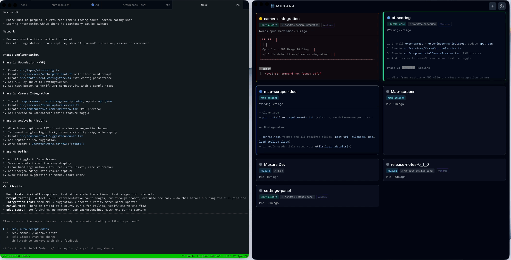

# Muxara

**A desktop control plane for managing parallel Claude Code sessions.**


<p align="center">
  
</p>

## What is Muxara?

Running multiple Claude Code sessions in parallel quickly becomes unwieldy. Which session needs your attention? Which is still working? Which one errored out ten minutes ago? And when your terminal crashes or your Mac restarts, good luck finding and resuming them all.

Muxara solves this by managing sessions inside tmux — they persist through terminal closes, app restarts, and machine restarts. No more lost sessions, no more `--resume` flags. Just reopen Muxara and everything is where you left it. The dashboard shows the live status of every session at a glance. Click any card to switch to it instantly, or use keyboard shortcuts to navigate without leaving the dashboard.

Anthropic offers a paid [Claude Code Desktop](https://claude.ai/code) app with built-in multi-session support. Muxara is a free, open-source alternative for CLI power users who don't have access to that, or who prefer a lightweight dashboard on top of their existing terminal workflow. We hope projects like this encourage Anthropic to open-source the desktop experience for everyone.

## Features

- **Persistent sessions** -- Sessions survive terminal crashes, app restarts, and machine restarts. Reopen Muxara and pick up exactly where you left off — no `--resume` needed
- **Live session dashboard** -- Auto-refreshing session cards showing status, working directory, and terminal output context
- **Smart status classification** -- Sessions are classified as NeedsInput, Working, Idle, or Errored using regex-based pattern matching on pane output with temporal delta detection
- **One-click session switching** -- Click a card to open or focus the tmux session in Terminal.app or iTerm2
- **Keyboard navigation** -- Arrow keys to move between cards in grid order, Enter to switch to the selected session
- **New session creation** -- Create sessions with an optional name, directory picker, and inline command editing
- **Automatic git worktree isolation** -- New sessions get isolated worktrees via Claude Code's `-w` flag, preventing conflicts between parallel sessions on the same repo
- **Configurable bootstrap command** -- Layered settings model with hardcoded defaults, user preferences, and per-project overrides
- **Kill and rename via context menu** -- Right-click any session card to rename it or kill it (with confirmation)
- **VS Code-style settings panel** -- Schema-driven UI for poll interval, grid columns, context zone height, output lines, and more
- **ANSI color rendering** -- Session output is displayed with faithful terminal colors
- **Working-to-Idle debounce** -- Configurable cool-off period prevents status flicker during brief pauses

## Requirements

- **macOS 12+** (Monterey or later)
- **tmux** -- `brew install tmux`
- **Terminal.app** (built-in) or **iTerm2** -- [iterm2.com](https://iterm2.com/)
- **Claude Code CLI** -- [claude.ai/code](https://claude.ai/code)

## Installation

### Homebrew (recommended)

```sh
brew tap muxara/muxara
brew install --cask muxara
```

### Manual download

Download the latest `.dmg` from [GitHub Releases](https://github.com/muxara/muxara/releases) and drag Muxara to your Applications folder.

### Build from source

```sh
git clone https://github.com/muxara/muxara.git
cd muxara
npm install
npm run tauri build
```

The built app will be in `src-tauri/target/release/bundle/`.

## Quick Start

1. Install Muxara and ensure tmux and Claude Code are available on your system.
2. Launch Muxara. The dashboard appears as a compact, always-on-top overlay window.
3. Click the **+** button in the header to create a new session.
4. Choose a working directory and optionally name your session. The bootstrap command is pre-filled from your settings.
5. Watch the session card appear on the dashboard. Status updates automatically as Claude Code works.

Repeat step 3 to spin up additional parallel sessions. Sessions that need your input are sorted to the top.

## Configuration

Muxara includes a VS Code-style settings panel accessible from the dashboard. See [docs/settings.md](docs/settings.md) for a full reference of all configurable options.

For technical details on architecture, module responsibilities, data flow, and key patterns, see [docs/architecture.md](docs/architecture.md).

## Troubleshooting

### Mouse scroll not working in iTerm2

If scrolling up in a session doesn't enter tmux copy mode (instead scrolling the iTerm2 buffer), enable mouse reporting:

**iTerm2 → Preferences → Advanced → search "mouse"** → enable *"Scroll wheel sends arrow keys when in alternate screen mode"*

This allows iTerm2 to forward scroll events to tmux, which handles entering/exiting copy mode automatically.

## Contributing

Contributions are welcome. Please see [CONTRIBUTING.md](CONTRIBUTING.md) for guidelines on how to get started, coding standards, and the pull request process.

## License

MIT. See [LICENSE](LICENSE) for details.
